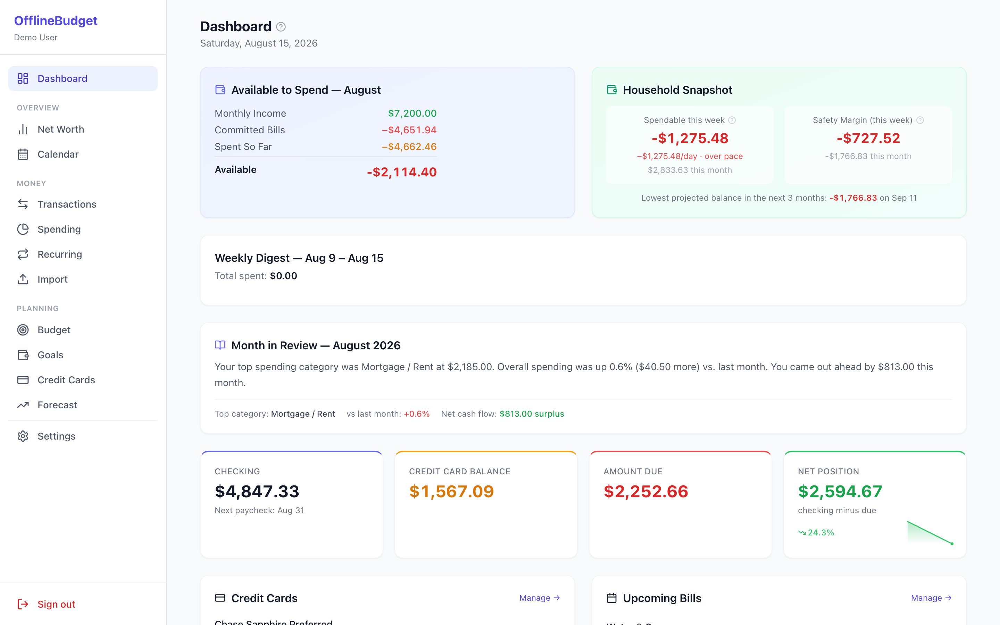

# Credit Card Transaction Processor & Tracker

A secure, offline tool for analyzing credit card transactions and tracking spending across multiple cards. Features intelligent merchant name cleaning, category budget tracking, time period analysis with monthly/quarterly/yearly breakdowns, comprehensive financial insights, and a modern web interface - all without storing credentials or requiring internet access.

[](https://github.com/your-username/credit-card-tracker)
[](https://github.com/your-username/credit-card-tracker)
[](https://github.com/your-username/credit-card-tracker)

## 🌟 Key Features

### 💻 **Modern Web Interface**
- **7-Tab Dashboard**: Complete spending overview, card management, budgets, transaction processing, analysis, historical data, and settings
- **Drag & Drop Upload**: Easy CSV file processing with visual feedback
- **Real-time Updates**: Live dashboard with auto-refresh and instant notifications
- **Responsive Design**: Works seamlessly on desktop, tablet, and mobile devices
- **Secure Local Processing**: All data processed on your machine with encrypted storage

### 📊 **Transaction Analysis**
- **Universal Compatibility**: Works with CSV files from any credit card provider (Chase, Amex, Capital One, etc.)
- **Smart Categorization**: Uses bank's existing categories when possible, falls back to intelligent keyword matching
- **6 Core Categories**: Shopping, Food & Drinks, Services, Entertainment, Groceries, Other
- **Merchant Name Cleaning**: Automatically cleans messy transaction names (e.g., "AMAZON MKTPL*WC4V41N33" → "AMAZON")
- **Detailed Analysis**: Category breakdowns, spending totals, clean merchant summaries

### 💳 **Credit Card Tracking**
- **Multi-Card Management**: Track spending across all your credit cards
- **Dual Balance Tracking**: Separate current spending from previous statement balances
- **Credit Limit Monitoring**: See available credit and spending limits
- **Due Date Tracking**: Never miss a payment with upcoming due date alerts
- **Spending Limits**: Set soft (savings goals) and hard (emergency) spending limits
- **Category Budgets**: Set and monitor monthly budgets for each spending category

### 📈 **Time Period Analysis**
- **Monthly/Quarterly/Yearly Breakdowns**: Analyze spending patterns over custom time periods
- **Trend Analysis**: Visual indicators (📈📉➡️) showing spending direction and percentage changes
- **Period Comparisons**: Month-over-month, quarter-over-quarter, and year-over-year analysis
- **Historical Storage**: Save and recall previous analyses for comparison
- **Category Trends**: Track specific category spending over time
- **Custom Date Ranges**: Analyze any date range from your transaction history

### 🔒 **Security & Privacy**
- **Secure Storage**: Encrypts local data using your system's secure keyring
- **Offline Processing**: Everything runs locally on your machine
- **No Credentials**: Never stores bank login information
- **Local Network Only**: Web interface accessible only on your home network

## 🚀 Quick Start

### Requirements
- Python 3.7 or higher
- Web browser (Chrome, Firefox, Safari, Edge)

### Installation

```bash
# Clone the repository
git clone https://github.com/your-username/credit-card-tracker.git
cd credit-card-tracker

# Install dependencies
pip install -r requirements.txt

# Start the web interface
cd web
python3 web_api_server.py
```

### First-Time Setup

1. **Access the Web Interface**
   ```
   Open your browser and go to: http://localhost:5001
   ```

2. **Add Your Credit Cards**
   - Click the "Manage Cards" tab
   - Add each of your credit cards with limits and dates
   - Example:
     ```
     Card Name: Chase Sapphire
     Credit Limit: $10,000
     Statement Date: 15 (15th of each month)
     Due Date: 12 (12th of each month)
     ```

3. **Set Budgets (Optional)**
   - Click "Budgets & Limits" tab
   - Set monthly spending limits and category budgets
   - Example:
     ```
     Monthly Limit: $2,000
     Shopping: $800
     Food & Drinks: $400
     Groceries: $350
     ```

4. **Upload Transaction Data**
   - Download CSV files from your credit card websites
   - Drag and drop files into the "Import Transactions" tab
   - Choose whether to update balances or analyze only

## 📱 Web Interface Guide

### Dashboard Tab
- **Real-time Overview**: Current spending, balance due, budget status
- **Visual Progress**: Color-coded budget bars and spending alerts
- **Due Date Alerts**: Upcoming payment reminders with urgency indicators
- **Auto-refresh**: Updates every 30 seconds



### Manage Cards Tab
- **Add New Cards**: Complete credit card configuration
- **Edit Existing**: Update limits, dates, balances
- **Balance Management**: Track current spending vs. statement balances
- **Card Overview**: Available credit and utilization

### Import Transactions Tab
- **Drag & Drop Upload**: Multi-file CSV processing
- **Processing Options**: 
  - Auto-update card balances
  - Category spending updates only
  - Analysis without updates
- **File Validation**: Automatic format checking and error reporting

### Time Period Analysis Tab
- **Flexible Date Ranges**: Custom start/end dates or all data
- **Grouping Options**: Month, quarter, or year analysis
- **Trend Indicators**: Visual spending direction indicators
- **Save Analyses**: Store for future comparison

### Historical Data Tab
- **Stored Analyses**: View previously saved analyses
- **Side-by-Side Comparison**: Compare different time periods
- **Trend Visualization**: Percentage changes and spending patterns

### Settings Tab
- **Data Management**: Reset balances, statement periods
- **Debug Information**: System status and troubleshooting
- **Export Options**: Download data in JSON format

## 🔧 Command Line Usage

For advanced users who prefer command-line tools:

### Initial Credit Card Setup

```bash
# Add your credit cards
python3 credit_card_tracker.py --add-card "Chase Sapphire" 10000 15 12 --add-card-desc "Primary rewards card"
python3 credit_card_tracker.py --add-card "Apple" 5000 28 25 --add-card-desc "Apple Card"

# Set spending limits
python3 credit_card_tracker.py --set-limits 2000 3000

# Set category budgets
python3 credit_card_tracker.py --set-budgets Shopping:800 "Food & Drinks":400 Services:300
```

### Transaction Processing

```bash
# Process transaction files and update balances
python3 credit_card_tracker.py --process-auto ~/Downloads/Chase*.csv

# Analyze transactions without updating balances
python3 transaction_processor.py ~/Downloads/chase_transactions.csv --analyze

# Category analysis
python3 transaction_processor.py transactions.csv --category "Food & Drinks"
```

### Time Period Analysis

```bash
# Monthly analysis with trends
python3 credit_card_tracker.py --analyze-period ~/Downloads/*.csv \
    --start-date 2024-01-01 --end-date 2024-06-30 --compare --trend total

# Save analysis for future comparison
python3 credit_card_tracker.py --analyze-period *.csv \
    --store-analysis "Q2_2024" --trend "Food & Drinks"

# Compare stored analyses
python3 credit_card_tracker.py --compare-analyses "Q1_2024" "Q2_2024"
```

## 📂 Getting Transaction Data

### Chase Bank Download Process

1. **Log into Chase Online Banking**
   - Go to [chase.com](https://www.chase.com) and sign in

2. **Navigate to Your Credit Card**
   - Click on the credit card you want to analyze

3. **Download Transactions**
   - Look for "Account Activity" or "Download account activity"
   - Select date range (up to 2 years available)
   - Choose **CSV format** (not PDF)
   - Download to your computer

### Other Credit Card Providers

The tool works with CSV files from all major providers:
- **American Express**: Download from "Statements & Activity"
- **Capital One**: Use "Download Transactions" feature
- **Discover**: Export from "Recent Activity"
- **Citi**: Download from "Account Activity"

## 📊 Analysis Examples

### Monthly Budget Review
```bash
# Web Interface: Upload current month's transactions via drag & drop
# CLI: Analyze current month with budget comparison
python3 credit_card_tracker.py --analyze-period current_month.csv \
    --start-date $(date +%Y-%m-01) --compare --trend total
```

**Sample Output:**
```
================================================================================
TIME PERIOD SPENDING ANALYSIS
================================================================================
Period       Total Spent  Transactions Avg/Transaction
-------------------------------------------------------
2024-01      $2,845.67    89           $31.97        
2024-02      $3,234.89    95           $34.05        
2024-03      $2,667.45    82           $32.53        
-------------------------------------------------------
TOTAL        $8,747.01    266          $32.87        

=== PERIOD COMPARISON (MONTH_OVER_MONTH) ===
2024-01 → 2024-02: +$389.22 (+13.7%) 📈
2024-02 → 2024-03: -$567.44 (-17.5%) 📉

=== TREND ANALYSIS ===
Category: Food & Drinks
Overall Trend: 📈 INCREASING (+12.3%)
```

### Category Deep Dive
```bash
# Web Interface: Use Time Period Analysis tab with category filter
# CLI: Analyze specific category trends
python3 transaction_processor.py transactions.csv --category "Shopping"
```

**Sample Output:**
```
=== Detailed Analysis: Shopping ===
Total Transactions: 45
Total Spending: $1,234.56
Average Transaction: $27.43

=== Top Merchants in Shopping ===
AMAZON                          : $  456.78 (12 transactions)
TARGET                          : $  234.56 (8 transactions)
COSTCO                          : $  189.34 (3 transactions)
```

## 🏗️ Project Structure

```
credit-card-tracker/
├── README.md                    # This file
├── requirements.txt             # Python dependencies
├── LICENSE                      # MIT License
├── core/                        # Core functionality
│   ├── __init__.py
│   ├── credit_card_tracker.py   # Main tracker logic
│   ├── transaction_processor.py # CSV processing
│   └── time_period_analysis.py  # Historical analysis
├── web/                         # Web interface
│   ├── web_api_server.py        # Flask server
│   ├── templates/
│   │   └── index.html           # Main web interface
│   └── static/                  # CSS, JS, images
├── data/                        # Encrypted data storage
│   ├── *.enc                    # Encrypted configuration files
│   ├── uploads/                 # Temporary upload directory
│   └── transaction_files/       # Your CSV files
├── docs/                        # Documentation
├── mobile/                      # Mobile app components
└── scripts/                     # Utility scripts
```

## 📋 API Documentation

The web interface provides a comprehensive REST API:

### Dashboard Endpoints
- `GET /api/summary` - Complete dashboard data
- `GET /api/cards` - Credit card information
- `GET /api/mobile-summary` - Simplified mobile data

### Card Management
- `POST /api/cards` - Add new credit card
- `PUT /api/cards/<name>` - Update card details
- `DELETE /api/cards/<name>` - Remove card

### Budget Management
- `POST /api/spending-limits` - Set monthly limits
- `POST /api/category-budgets` - Set category budgets

### Transaction Processing
- `POST /api/upload-transactions` - Upload and process CSV files

### Historical Analysis
- `GET /api/historical-analyses` - List stored analyses
- `POST /api/compare-analyses` - Compare two analyses

### Data Management
- `POST /api/reset-statement` - Reset statement periods
- `POST /api/reset-balances` - Reset card balances

## 🎯 Category System

The system automatically categorizes transactions into 6 main categories:

| Category | Examples |
|----------|----------|
| 🛍️ **Shopping** | Amazon, Walmart, Target, Costco, Best Buy, Pharmacies |
| 🍕 **Food & Drinks** | Restaurants, Fast Food, Coffee Shops, Bars, Delivery Services |
| 🔧 **Services** | Healthcare, Insurance, Utilities, Subscriptions, Professional Services |
| 🎬 **Entertainment** | Movies, Travel, Hotels, Sports Events, Books, Gaming |
| 🥬 **Groceries** | Supermarkets, Whole Foods, Trader Joe's, Farmers Markets |
| 📋 **Other** | Any transaction that doesn't fit the above categories |

## 🛡️ Security Features

- **Encryption**: All data encrypted using your system's secure keyring
- **Local Processing**: No data transmitted to external servers
- **No Credentials**: Never stores bank login information
- **Local Network**: Web interface only accessible on your home network
- **Temporary Files**: Uploaded files automatically cleaned after processing
- **Input Validation**: All user inputs sanitized and validated

## 🔧 Advanced Configuration

### Custom Category Rules
Edit `core/transaction_processor.py` to customize categorization:

```python
# Add custom merchant patterns
merchant_patterns = {
    'MY_CUSTOM_STORE': ['CUSTOM STORE', 'CUSTOM SHOP'],
    # Add your patterns here
}
```

### API Rate Limiting
For production use, consider adding rate limiting:

```python
# In web_api_server.py
from flask_limiter import Limiter

limiter = Limiter(
    app,
    key_func=lambda: request.remote_addr,
    default_limits=["200 per day", "50 per hour"]
)
```

## 🐛 Troubleshooting

### Common Issues

**"No template found" Error**
```bash
# Make sure you're running from the correct directory
cd web
python3 web_api_server.py

# Or use absolute paths
python3 /path/to/project/web/web_api_server.py
```

**CSV Processing Errors**
- Ensure CSV files are in the correct format
- Check that files have required columns: Transaction Date, Description, Amount
- Verify file encoding (UTF-8, Latin-1, or CP1252 supported)

**Port Already in Use**
```bash
# The server automatically tries ports 5001-5010
# If all are busy, manually specify a port:
flask run --host=127.0.0.1 --port=5020
```

**Permission Errors on File Upload**
```bash
# Check upload directory permissions
chmod 755 data/uploads/
```

### Debug Information

Access debug info at: `http://localhost:5001/api/debug`

Or use command line:
```bash
python3 credit_card_tracker.py --summary  # Show current status
```

## 🚀 Performance Tips

### Large Transaction Files
- Process files in smaller batches (6 months at a time)
- Use SSD storage for better I/O performance
- Close other applications during large file processing

### Web Interface Optimization
- Use modern browsers (Chrome, Firefox, Safari, Edge)
- Enable hardware acceleration in browser settings
- Close unused browser tabs during heavy processing

## 🔄 Data Migration

### From Version 1.x to 2.x
```bash
# Backup your data first
cp -r data/ data_backup/

# Run migration script
python3 scripts/migrate_v1_to_v2.py

# Verify migration
python3 credit_card_tracker.py --summary
```

### Export/Import Data
```bash
# Export all data
python3 credit_card_tracker.py --export-data backup.json

# Import data (new installation)
python3 credit_card_tracker.py --import-data backup.json
```

## 📱 Mobile App (Coming Soon)

We're developing companion mobile apps:

- **iOS App**: Native Swift application for iPhone/iPad
- **Android App**: Native Kotlin application
- **React Native**: Cross-platform mobile solution

Features will include:
- Read-only dashboard access
- Budget notifications
- Due date reminders
- Quick balance checks

## 🤝 Contributing

We welcome contributions! Please see our [Contributing Guide](CONTRIBUTING.md) for details.

### Development Setup
```bash
# Clone and set up development environment
git clone https://github.com/your-username/credit-card-tracker.git
cd credit-card-tracker

# Create virtual environment
python3 -m venv venv
source venv/bin/activate  # Linux/Mac
# or
venv\Scripts\activate     # Windows

# Install development dependencies
pip install -r requirements-dev.txt

# Run tests
python3 -m pytest tests/

# Start development server
cd web
python3 web_api_server.py
```

### Code Style
- Follow PEP 8 for Python code
- Use ESLint for JavaScript
- Write tests for new features
- Update documentation

## 📄 License

This project is licensed under the MIT License - see the [LICENSE](LICENSE) file for details.

## 🙏 Acknowledgments

- **Security Focus**: Built with security professionals in mind
- **Privacy First**: No telemetry, analytics, or external data transmission
- **Open Source**: Community-driven development
- **Cross-Platform**: Works on Windows, macOS, and Linux

## 📞 Support

- **Documentation**: Check this README and the `/docs` folder
- **Issues**: Report bugs on [GitHub Issues](https://github.com/your-username/credit-card-tracker/issues)
- **Discussions**: Join conversations on [GitHub Discussions](https://github.com/your-username/credit-card-tracker/discussions)
- **Security**: Report security issues privately to [security@yourproject.com](mailto:security@yourproject.com)

## 🔮 Roadmap

### Version 2.1 (Current)
- ✅ Modern web interface with 7-tab navigation
- ✅ Drag & drop file upload
- ✅ Real-time dashboard updates
- ✅ Complete API coverage
- ✅ Mobile-responsive design

### Version 2.2 (Planned)
- 📱 Native mobile applications (iOS/Android)
- 📊 Advanced visualization charts
- 🔄 Automatic bank data synchronization (optional)
- 🏦 Support for bank-specific CSV formats
- 📈 Machine learning transaction categorization

### Version 3.0 (Future)
- 🌐 Multi-user support with role-based access
- 🔗 Integration with personal finance platforms
- 📊 Advanced reporting and analytics
- 🔒 Hardware security module support
- ☁️ Optional encrypted cloud backup

---

**Built with ❤️ for security-conscious financial tracking**

> *"Take control of your finances without compromising your privacy"*