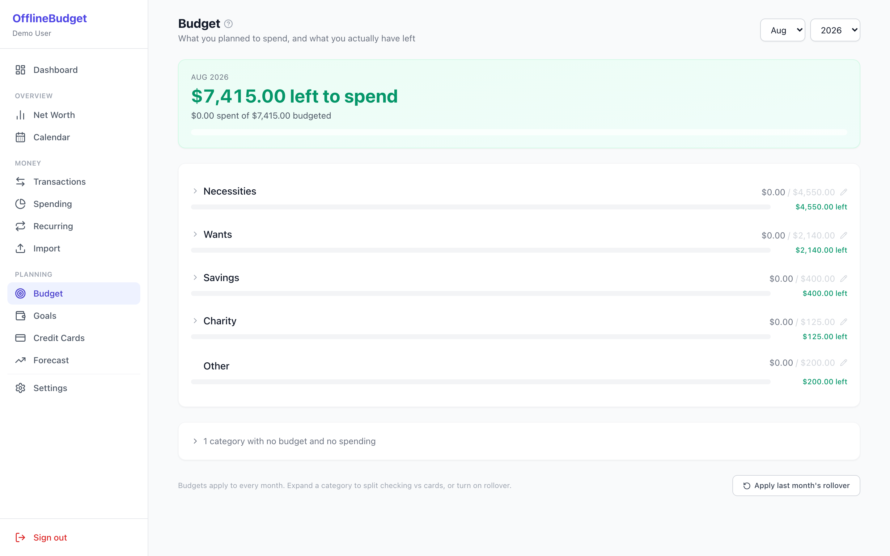
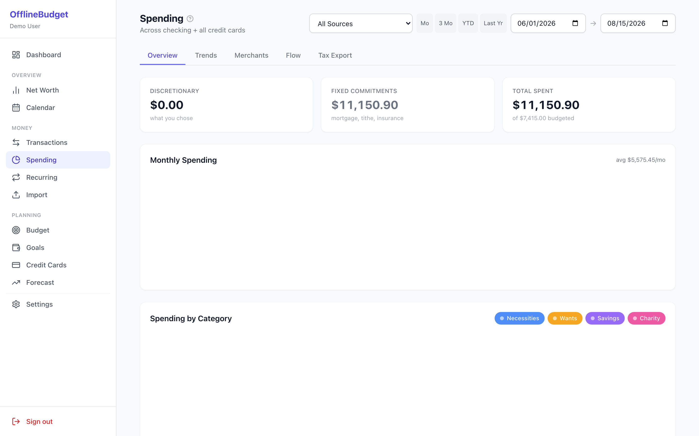
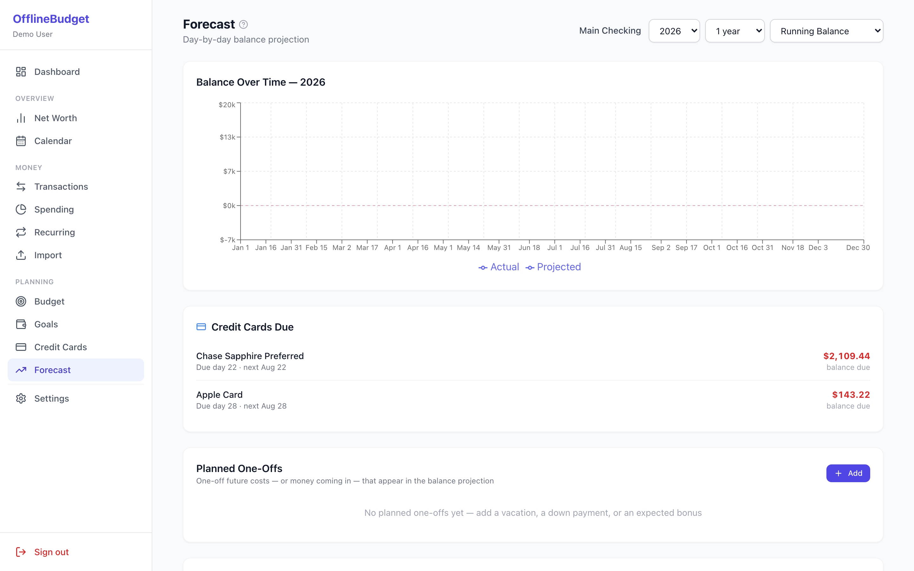

# OfflineBudget

A forecasting-first household budget tracker that runs entirely on your own
network. No subscriptions, no cloud sync, no third party holding your
financial data.

Built with FastAPI + SQLite on the backend and React + TypeScript on the
frontend.

---

## Guides

| Guide | What's in it |
|-------|--------------|
| [Getting Started](start-guide.md) | Install, first run, LAN access, setting up your first budget |
| [Technical Guide](technical-guide.md) | Architecture, data model, the forecast engine, adding features |
| [Demo Data](demo-data.md) | The bundled sample household and how to load it |
| [Future Work](future-work.md) | What's planned next |

Source and issues: [github.com/rookford343/OfflineBudget](https://github.com/rookford343/OfflineBudget)

---

## What it looks like

Every screenshot below uses the bundled demo dataset — a fictional
dual-income household. No real financial data appears in this repository.

### Dashboard

Household Snapshot, Available to Spend, and a plain-English month in review.

### Budget

One headline answering "how much is left this month", then a progress bar per
category. The checking-vs-card split is one click away rather than a column.

### Spending

Leads with discretionary spend — the part you actually decide — with fixed
commitments reported separately.

### Forecast

Day-by-day balance projection, credit cards due, and planned one-offs.

---

## The ideas behind it

**Forecast first.** Most budget apps tell you what you already spent. The
question that actually changes a decision is what your balance will be on the
25th, so the forecast engine walks every day forward from today: recurring
bills, paychecks, credit-card payoffs on their real statement cycle, and any
one-off you've planned.

**Discretionary is the number that matters.** A spending list topped by your
mortgage tells you nothing you can act on. Fixed commitments are separated
from the spending you actually chose.

**Money moving between your own accounts isn't spending.** Transfers and
credit-card payoffs are excluded from spending totals — a payoff settles
charges already counted individually, so counting it again would
double-count the whole statement.

**It should survive a laptop that sleeps.** Scheduled email and bank sync
both self-heal: a missed trigger fires when the machine wakes, and a periodic
sweep retries anything that hasn't succeeded today.
